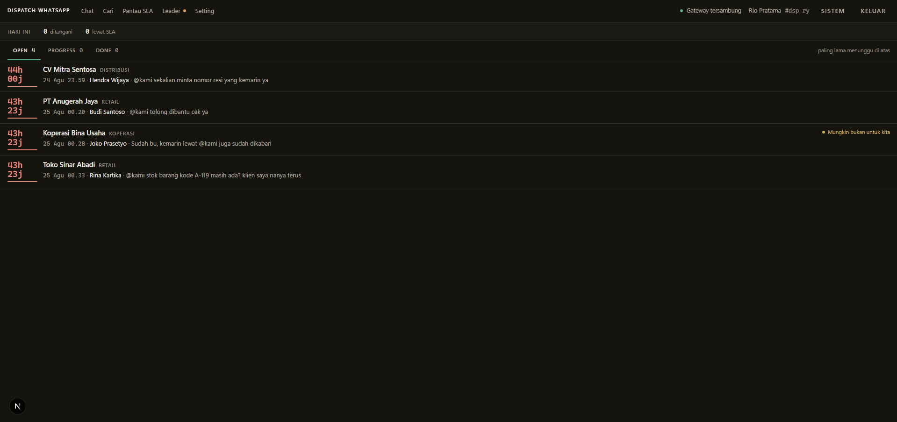
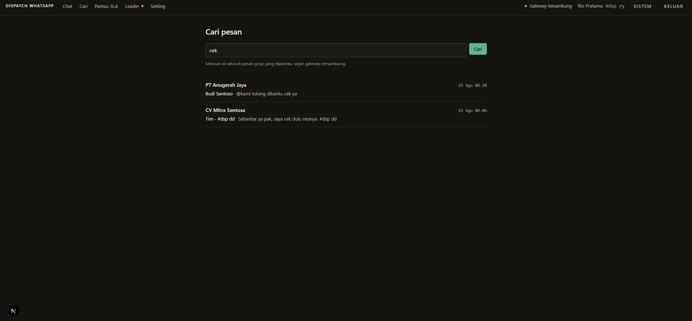
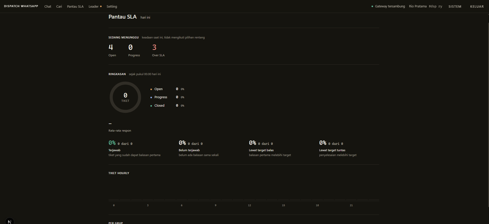

# Dispatch WhatsApp

A ticketing dashboard for teams that support customers inside WhatsApp groups.
When a customer mentions your team or replies to one of your messages, it
becomes a ticket. One agent owns each ticket, so nobody answers twice, and
response times are tracked against your SLA automatically.



## Features

- **Tickets from group chats.** Mentions and replies to your team open a ticket. Every other message is still stored, so each ticket shows the full conversation around it.
- **One owner per ticket.** Claiming is atomic, a ticket can be taken over when needed, and abandoned tickets go back to the queue.
- **Safe sending.** Replies are held on the server for a few seconds so they can be undone, each send has an idempotency key, and a failed send puts the ticket back in the queue with the draft intact.
- **Agent attribution.** A short signature code (`#dsp xx`) is added to every reply, so even replies sent from a phone are credited to the right agent.
- **SLA you can trust.** Targets are copied onto each ticket when it is created, reports use the median, and every settings change is audited.
- **Handles WhatsApp's new IDs.** Works with both phone-number IDs and the newer LID format, including mentions that arrive as plain `@<LID>` text.
- **Three roles.** Agents work the queue, leaders also see team stats and settings, and an SLA role sees only the numbers.

The interface is in Indonesian.

## Quick start (demo)

Requires Docker. Nothing connects to WhatsApp: a mock gateway stands in for it.

```bash
git clone https://github.com/aritimex7/wa-group-ticketing.git
cd wa-group-ticketing
docker compose -f docker-compose.demo.yml up --build
```

Open http://localhost:3000 and sign in:

| User | Role | Password |
|---|---|---|
| `rio` | leader | `rahasia123` |
| `ayu`, `dedi`, `nina` | agent | `rahasia123` |

The demo comes with sample groups, messages and open tickets. Replies you send
go to the mock gateway and come back as delivered. To use another port, run
with `DEMO_PORT=8000`. Stop it with `docker compose -f docker-compose.demo.yml down -v`.

## Tech stack

Next.js 16 (App Router), React 19, TypeScript, PostgreSQL with Drizzle ORM,
Tailwind CSS 4, Docker Compose. WhatsApp access goes through
[Evolution API](https://github.com/EvolutionAPI/evolution-api) or
[WAHA](https://github.com/devlikeapro/waha).

## Running it for real

### 1. Configure

```bash
cp .env.example .env
```

Fill in at least `POSTGRES_PASSWORD`, `DATABASE_URL`, `AUTH_SECRET` and
`GATEWAY_API_KEY`. Every variable is explained in `.env.example`.

### 2. Start Postgres and the gateway

```bash
docker compose up -d
```

This runs Postgres and Evolution API. They are kept separate from the web app
on purpose: redeploying the app never drops the WhatsApp session.

### 3. Create the tables and the first accounts

```bash
npm install
npm run db:migrate
npm run db:seed     # sample accounts and data; skip in production
```

### 4. Start the app

```bash
npm run dev         # or: npm run build && npm start
```

The app runs on http://localhost:3000.

### 5. Connect a WhatsApp account

1. Open http://localhost:8080/manager and create an instance named after `GATEWAY_INSTANCE`.
2. Scan the QR code with a **test number first**, not your main work number.
3. Leave `FASE0_DUMP=on` for a few days and run `npm run fase0:report`. It shows the real payload shapes your gateway sends, so you can confirm the parser handles them.
4. Fill in `WA_SELF_PN` and `WA_SELF_LID`. Your LID is in the `me` field of the `connection.update` payload in `var/raw/`. It cannot be derived from the phone number.
5. On the Settings page, turn on monitoring for the groups you want to track. New groups are off by default.

## Configuring for your team

Everything team specific lives in the app's **Settings** page (leader only):
agents and their signature codes, monitored groups and per-group SLA targets,
quick replies, phrases to ignore (such as "ok" or "thanks"), and the IP
allowlist. All changes are recorded in the settings history.

## Testing

```bash
npm run typecheck
npm run smoke       # runs every query against a real Postgres
```

Run `smoke` after touching any query: the type checker passes on some query
bugs that only fail at runtime.

`scripts/gateway-tiruan.mjs` is a mock of the Evolution API. It answers like
the real gateway and echoes sent messages back as webhooks, so the full send
flow can be tested without a WhatsApp account. The demo uses it.

## Project structure

| Area | Files |
|---|---|
| Database schema | `src/db/schema.ts`, migrations in `drizzle/` |
| Webhook ingestion | `src/lib/ingest.ts`, `src/app/api/webhook/[provider]/route.ts` |
| Gateway adapters | `src/lib/gateway/evolution.ts`, `src/lib/gateway/waha.ts` |
| Phone number vs LID identity | `src/lib/identity.ts`, `src/lib/mention.ts` |
| Ticket rules (claim, takeover, release) | `src/lib/tickets.ts` |
| Conversation threads | `src/lib/thread.ts` |
| Outbox, undo, idempotency | `src/lib/outbox.ts` |
| SLA and reports | `src/lib/sla.ts`, `src/lib/leader.ts`, `src/lib/queries.ts` |
| Settings and audit | `src/lib/settings.ts`, `src/app/(app)/setelan/` |
| Roles and access | `src/lib/auth.ts` |
| Background jobs | `src/lib/tick.ts`, `src/app/api/cron/tick/route.ts` |

The full functional spec is in `docs/SPEC.md` and a production deployment guide
(VPS, HTTPS, backups) is in `docs/DEPLOY.md`. Both are in Indonesian. Notes for
WSL and a staging setup are in `docs/WSL-AND-STAGING.md`.

## Commands

| Command | What it does |
|---|---|
| `npm run dev` | start the app in development mode |
| `npm run build` / `npm start` | production build and server |
| `npm run db:migrate` | apply migrations |
| `npm run db:generate` | create a migration from schema changes |
| `npm run db:seed` | load sample accounts and data |
| `npm run db:reset -- --ya` | delete all operational data, keep agents and settings |
| `npm run fase0:report` | summarize captured webhook payloads |
| `npm run fase0:putar-ulang` | replay captured payloads through ingestion |
| `npm run smoke` | run every query against the database |

## Notes

- Evolution API and WAHA log in as a linked WhatsApp device. That is an
  unofficial client, it is against WhatsApp's terms of service, and the number
  can be banned. Test with a separate number, and never use it for bulk messages.
- The gateway uses one linked-device slot. Open WhatsApp on the main phone at
  least every 14 days, or all linked sessions are logged out.
- Delivery is confirmed when WhatsApp echoes the sent message back. Group
  messages never receive a separate delivery or read receipt from the gateway.
- All names, numbers and messages in this repository and its screenshots are fictional.

| Search | SLA monitor |
|---|---|
|  |  |
